#  Hey there! I'm **Ayyoob K A**

<div align="center">


</div>

<div align="center">
  
  
  
</div>

---

## 🧑‍💻 **About Me**

```yaml
name: "Ayyoob K A"
role: "Flutter Developer"
experience: "2+ Years"
company: "Nexteons"
email: "ayyoobfouj@gmail.com"
portfolio: "https://portfolio-self-six-52.vercel.app/"
philosophy: "Clean code, accessibility, and problem-solving"
passion: "Futuristic design & immersive user experiences"
location: "India"
currently_learning: ["Rust", "Advanced Flutter Animations", "WebGL"]
```


### 🚀 **What I Build**

- **🏦 Finora** → OTP-based authentication system in Go (SMTP + Gmail + HTML templates)
- **🎨 Personal Portfolio** → Liquid Glass 4D style with Next.js, React Three Fiber, Tailwind CSS, Framer Motion
- **📱 Flutter Apps** → Authentication flows, dashboards, map-based apps, expense managers, custom video players
- **⚙️ Go Backend Systems** → Authentication, PostgreSQL, Redis, real-time APIs
- **🦀 Rust Projects** → Building `libhapticsync` (haptic synchronization engine with real-time playback)

---

## 🛠️ **Tech Arsenal**

<div align="center">

### **Languages**


### **Frameworks & Libraries**


### **Backend & Tools**


</div>

---

## 📊 **GitHub Analytics**

<div align="center">
  
  
</div>

<div align="center">
  
</div>

---

## 🏆 **GitHub Trophies**

<div align="center">
  
</div>

---

## 🎯 **Current Focus**

```mermaid
graph LR
    A[🦀 Rust Development] --> B[🎮 libhapticsync Engine]
    C[📱 Flutter Mastery] --> D[🎨 Advanced Animations]
    E[🌐 Full-Stack] --> F[⚡ Real-time Systems]
    
    style A fill:#000000,stroke:#00d9ff,color:#fff
    style B fill:#0d1117,stroke:#00d9ff,color:#fff
    style C fill:#02569B,stroke:#00d9ff,color:#fff
    style D fill:#0d1117,stroke:#00d9ff,color:#fff
    style E fill:#00ADD8,stroke:#00d9ff,color:#fff
    style F fill:#0d1117,stroke:#00d9ff,color:#fff
```

<div align="center">



</div>

---

## 🌟 **Featured Projects**

<div align="center">

| Project | Description | Tech Stack |
|---------|-------------|------------|
| 🚀 **Finora** | OTP-based authentication system with SMTP integration | Go, PostgreSQL, HTML Templates |
| 🎨 **Portfolio** | Liquid Glass 4D style personal website | Next.js, Three.js, Framer Motion |
| 🦀 **libhapticsync** | Real-time haptic synchronization engine | Rust, Audio Processing |
| 📱 **Flutter Suite** | Mobile apps with custom video players & gesture controls | Flutter, Dart, Firebase |

</div>

---

## 🎨 **Activity Graph**

<div align="center">
  
</div>

---

## 🤝 **Let's Connect**

<div align="center">

[](https://portfolio-self-six-52.vercel.app/)
[](https://www.linkedin.com/in/ayyoobka)
[](mailto:ayyoobfouj@gmail.com)

</div>

---

<div align="center">

### 💡 **"Not just coding — creating meaningful digital experiences"**


</div>

---

<div align="center">
  
</div>

---

<div align="center">

**⭐ From [Ayyoob K A](https://github.com/ayyoobka) with 💙**

*Last updated: 2024*

</div>
